# Productivity & Entertainment Web App

This is a full-stack web application designed to improve productivity, manage personal finances, and provide casual entertainment. Built with **Angular** (frontend) and **Node.js with Express** (backend), it offers tools like a task planner, expense tracker, bill splitter, and a couple of classic games.

---

## 🚀 Features

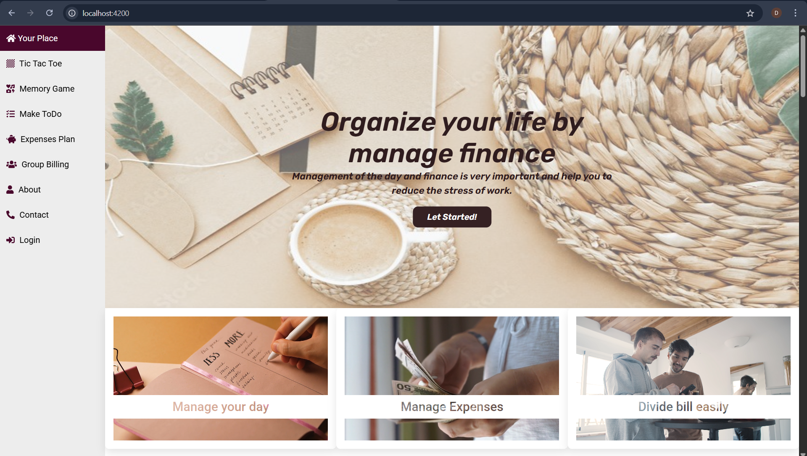
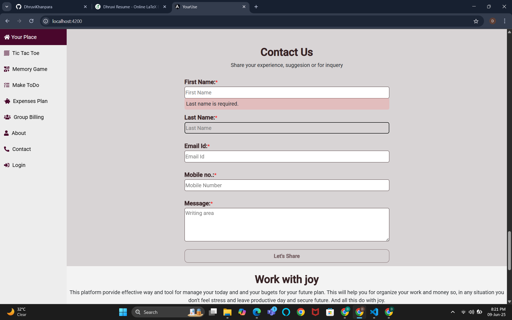

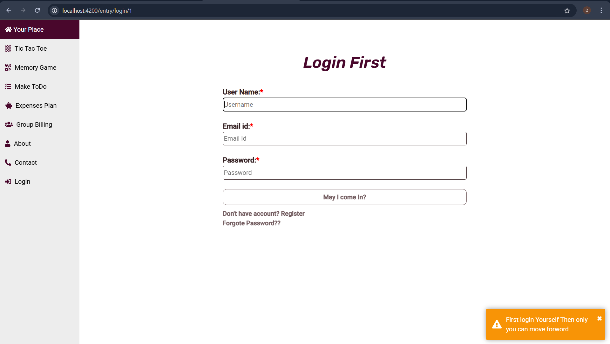
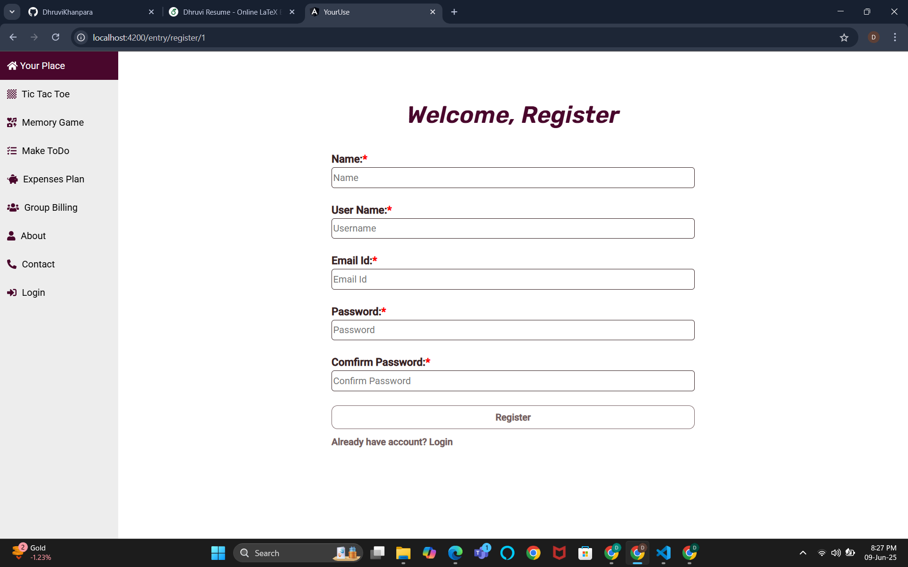

### ✅ Task Management (To-Do List)
- Create daily work plans with time-bound tasks.
- Drag and drop to change task status between **Pending**, **Running**, and **Done**.

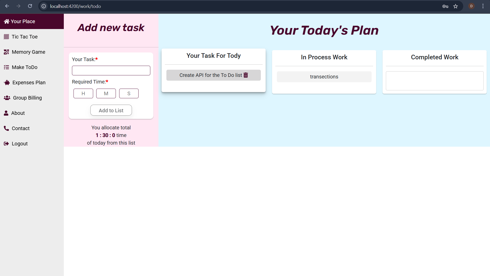

### 💰 Expense Management
- Track your daily, weekly, or monthly expenses and savings.
- Simple UI for adding and reviewing expenses.

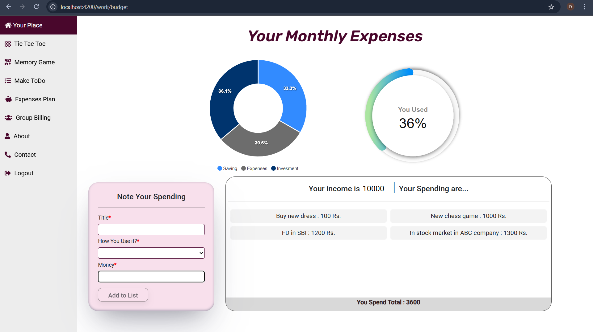

### 🤝 Bill Splitting
- Split group expenses with friends, family, or colleagues.
- Easy and transparent way to manage shared costs.

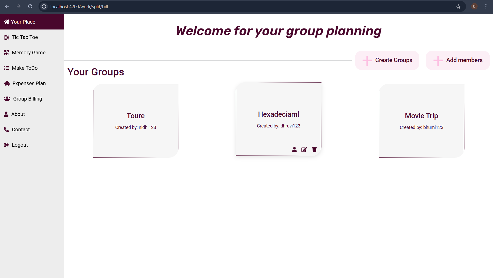
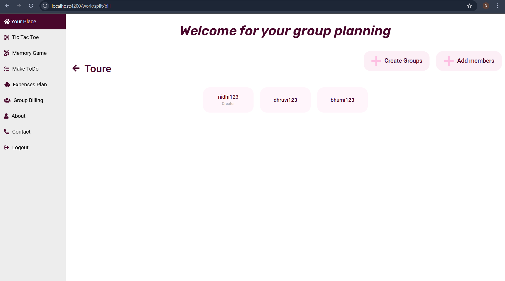
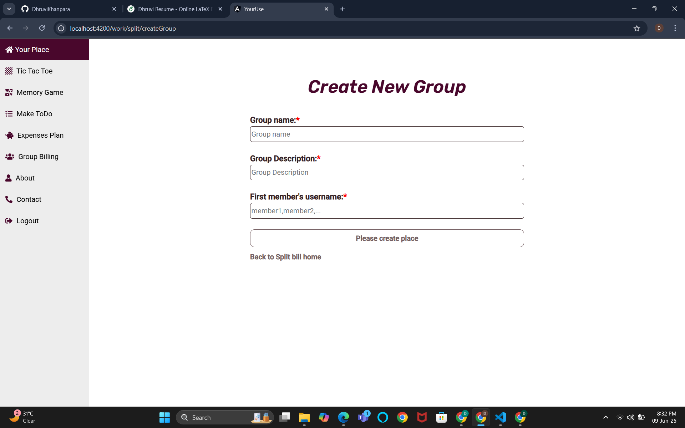
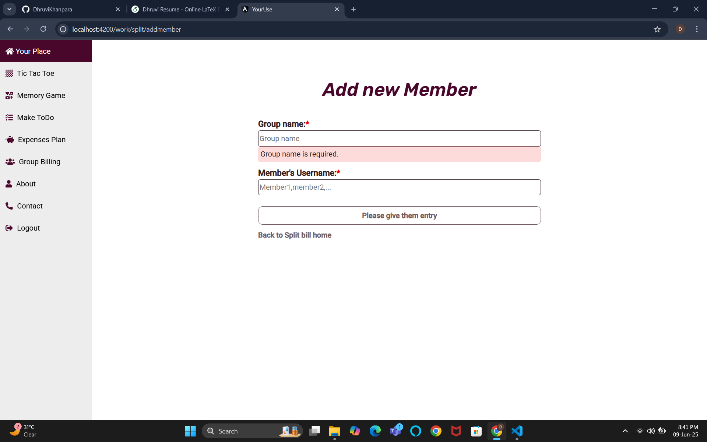
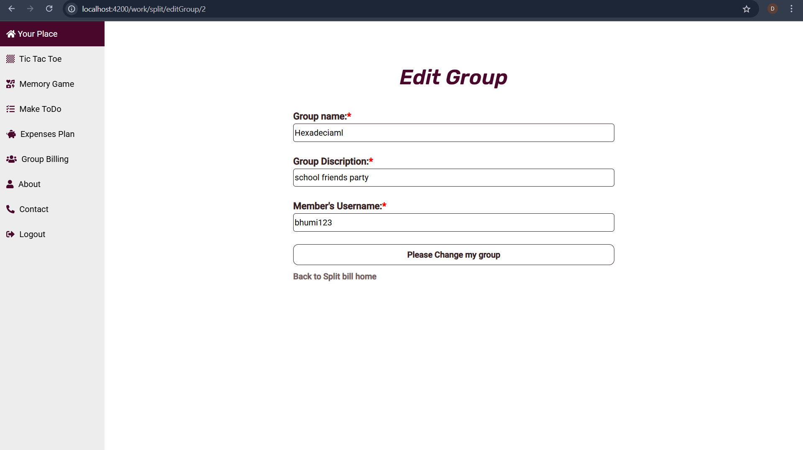
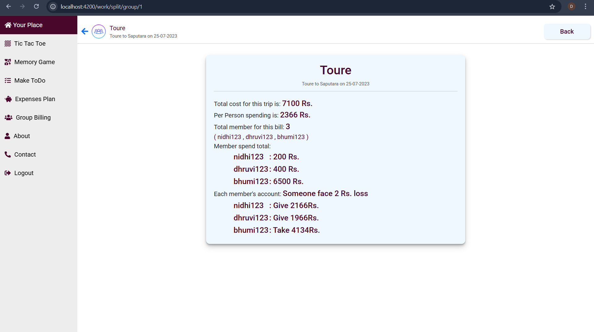

### 🎮 Built-in Games
- **Tic-Tac-Toe**
  - Play solo or with a friend.

  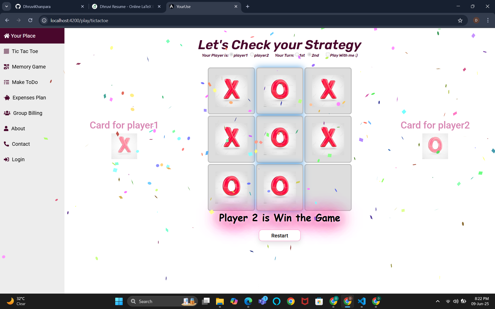

- **Memory Card Game**
  - One-player and two-player modes to test memory skills.

  
  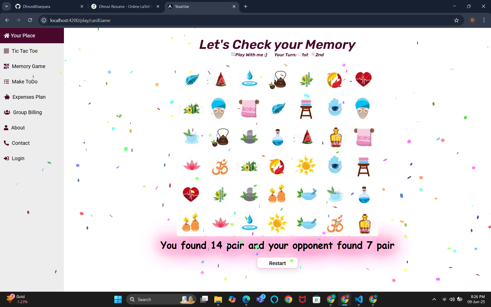

---

## 🛠 Tech Stack

| Frontend   | Backend        |
|------------|----------------|
| Angular    | Node.js        |
| TypeScript | Express.js     |
| HTML/CSS   | REST API       |

---

# YourUse

This project was generated with [Angular CLI](https://github.com/angular/angular-cli) version 14.0.0.

## Development server

Run `ng serve` for a dev server. Navigate to `http://localhost:4200/`. The application will automatically reload if you change any of the source files.

## Code scaffolding

Run `ng generate component component-name` to generate a new component. You can also use `ng generate directive|pipe|service|class|guard|interface|enum|module`.

## Build

Run `ng build` to build the project. The build artifacts will be stored in the `dist/` directory.

## Running unit tests

Run `ng test` to execute the unit tests via [Karma](https://karma-runner.github.io).

## Running end-to-end tests

Run `ng e2e` to execute the end-to-end tests via a platform of your choice. To use this command, you need to first add a package that implements end-to-end testing capabilities.

## Further help

To get more help on the Angular CLI use `ng help` or go check out the [Angular CLI Overview and Command Reference](https://angular.io/cli) page.

## Backend is connection

Get backend from GIT and after setup to your system just run the node project. In this JSON file is use for data storing so no need any DB configuration. (`nodemon` -> for run node backend)
